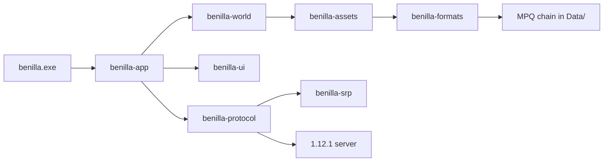
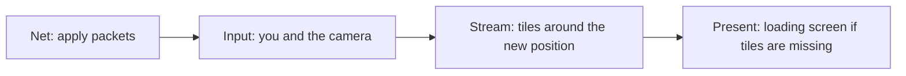

# How a run moves through benilla

A reading guide for the current tree. It follows one launch from `main` to a
frame in the world, then says what each layer is for. `docs/MAP.md` is the
generated list of modules. `docs/FORK.md` is what this fork changes from
upstream. When this file and the code disagree, the code wins.

## The shape

One process. Bevy owns the window, the frame, and the entity world. A
background thread owns the sockets. They meet through channels.

The crates split on purpose:

| Crate | Knows about | Does not know about |
| --- | --- | --- |
| `benilla-mpq`, `benilla-blp`, `benilla-dbc`, `benilla-adt`, `benilla-wdt`, `benilla-m2`, `benilla-wmo`, `benilla-bytes` | One file format | Bevy, the network, the game |
| `benilla-formats` | The install: the MPQ chain and the DBC catalogues | Bevy |
| `benilla-srp`, `benilla-protocol` | The 1.12.1 wire (build 5875) | Bevy |
| `benilla-ui` | TOC, FrameXML, layout, the Lua host | Bevy, the GPU |
| `benilla-assets` | Those files as Bevy assets, under `mpq://` | A player or a server |
| `benilla-world` | Terrain, models, sky, collision, the camera's world | A server, a player, a UI |
| `benilla-app` | The game: login, the session, the player, every window | — |
| `benilla` | `fn main` and the git stamp | Almost everything else |

`benilla-worldview` runs `benilla-world` with no game attached. That split is
the check that the engine stays free of login, packets, and FrameXML.

## Startup

`crates/benilla/src/main.rs` stamps the git revision at compile time and calls
`benilla_app::run`. A new commit rebuilds the shim and relinks. It does not
rebuild the game crate. `run_with` is the same entry plus a hook for a crate
stacked on top (`crates/benilla-app/examples/extended_launcher.rs`).

`launch` in `crates/benilla-app/src/lib.rs` then:

1. Resolves the project folder from the stamp, so a dev build finds
   `benilla-config/` and `.probe-identity` beside the source.
2. Installs the crash writer (`benilla-config/Diagnostics/`).
3. Finds the install with `benilla_formats::wow_data`: `$WOW_DATA`, else
   `<project>/WoW/Data` on a dev build, else `Data` beside the binary.
4. Registers the `mpq://` asset source before Bevy's asset plugin exists.
5. Opens the window from the saved video settings (`benilla-config/config.toml`).
6. Adds `WorldPlugins`, then `GamePlugins`, then asset loaders, then the dev
   probes.
7. Calls `app.run()`.

`Update` and `PostUpdate` run single-threaded. Most of those systems hold
`mlua` or the audio mixer, which are not `Send`. `Render` stays
multi-threaded. `WOW_MT_UPDATE=1` puts `Update` back on the thread pool.

The first `OnEnter` of `ClientState` is moved to after `PostStartup`
(`benilla-world/src/schedule.rs`). The login screen, the Lua VM, and the
catalogues exist before that enter runs.

## The four screens

`ClientState` in `crates/benilla-app/src/char_select/mod.rs` is the session:

| State | What you see | What the net thread is doing |
| --- | --- | --- |
| `Login` | Account name and password | Parked, waiting for a `LoginRequest` |
| `CharSelect` | The roster | Parked on the world socket, waiting for a pick |
| `CharCreate` | The create screen | Still parked. Create and delete are served in place |
| `InWorld` | The world | Streaming packets until logout or a drop |

The realm list is a dialog over whichever screen is up, not a fifth state.
`GlueParent.lua` treats it the same way.

`WorldLive` is a separate bit, written every frame from "are we `InWorld`?".
Terrain, units, and the in-game UI gate on it. It is a resource, not a Bevy
state, so teardown is the same frame you leave.

With no server the client sits on the login screen. `$WOW_CAPTURE` skips the
network and can boot straight into a world for a screenshot.

## From the login box to your character

Policy lives on the Bevy side. Sequencing lives on the net thread. The thread
never sleeps and never decides to retry.

The login screen (`crates/benilla-app/src/login/mod.rs`) submits when
`WOW_USER` and `WOW_PASS` are both set, or when you press the button. A
refusal shows a dialog and clears the attempt. A dropped socket while
credentials are still pending retries every 3 seconds. A lost world session
returns to the login screen. An unattended run may reconnect. A normal run
does not, because logging in again would kick whoever holds the account.

`spawn_net` (`crates/benilla-app/src/net/io.rs`) starts two threads:

- `wow-net` reads. It walks one connection, then parks again.
- `wow-net-write` is long-lived. Each new world connection hands it a fresh
  writer. Movement packets queue here.

One cycle, in `run` in that file:

1. Wait for credentials.
2. Log on to realmd. Auth is SRP6, login protocol version 3, client build
   5875 (`benilla-protocol`, `benilla-srp`). Default port 3724. The host is
   `WOW_HOST` or the Realmlist button, remembered as `host` or `host:port`.
3. Park and publish the realm list.
4. World handshake on port 8085. The session key from SRP encrypts the world
   headers.
5. Receive the character roster and park.
6. On a pick, send `CMSG_PLAYER_LOGIN` and tell the app the world is coming.
   The reference is already loading the destination by then, so terrain starts
   a round trip early. `SMSG_CHARACTER_LOGIN_FAILED` unwinds the entry.
7. Stream `SessionEvent`s until logout, a dead socket, or exit.

Create and delete happen at step 5 without leaving the park. The create
screen reads `CharCreateCatalog` (`benilla-formats` `characters`). The server
still accepts or refuses the pair from its own `playercreateinfo` rows. This
fork's gnome paladin is that catalogue plus those rows (`docs/FORK.md`).

Inbound events sit on a channel. Each frame `apply_net_updates`
(`crates/benilla-app/src/net/apply.rs`) drains them in wire order through the
handler table (`net/handlers.rs`). Each subsystem registers a one-shot system
per event kind. An opcode with no handler is dropped. The handler's writes
are visible to the next packet in the same frame.

## Entering the world

The server streams your own player as an object create. `tag_self_player`
marks that entity `SelfPlayer` once both the guid and the create have arrived.
`enter_world_on_self_create` then sends `CMSG_SET_ACTIVE_MOVER` and writes
`WorldEnterCascadeMessage`.

That edge loads the in-game UI (`ui_script/lifecycle.rs`):

1. Throw away the glue VM and build a new one. Every login runs addon file
   scope again.
2. Seed CVars, the realm name, and a `"player"` unit taken from the roster
   row, so addon code at file scope can call `UnitName("player")` before the
   object finishes streaming.
3. Load stock `Interface/FrameXML` off the install, byte for byte.
4. Load this fork's interface layer, which sits after stock files and before
   addons.
5. Load each enabled addon from `benilla-config/AddOns/<Name>/<Name>.toc`.

`PLAYER_LOGIN` and the world-enter queries wait until `SelfPlayer` exists.
The server has seated you by then, so those queries are not sent into a void.

`SMSG_LOGIN_VERIFY_WORLD` and `SMSG_NEW_WORLD` throw the streamed world away.
A login, a reconnect, and a boat or portal to another map all create you
again. A teleport on the same map does not.

While the tiles around you are missing, the loading screen covers the view
(`loading_screen`). The camera still renders underneath it, which compiles
the world's pipelines during the cover.

## One frame in the world

Four stages run in order inside `Update`, chained
(`benilla-world/src/schedule.rs`):

A teleport snaps in `Net`, the player reads the snap in `Input`, tiles stream
around the new spot, and the cover is up in the same frame.

After that chain, the rest of `Update` runs: animation, nameplates, sound,
the UI extract, and the per-feature plugins. `PostUpdate` propagates
transforms. The render app draws terrain, models, sky, then the UI quads.

Leaving the world is the falling edge of `WorldLive`. Each world system sees
that edge once and releases what it loaded. The UI runs its shutdown and a
fresh glue VM is installed for the character screen.

## Where the pictures come from

The install is read-only. Nothing in this process writes into `Data/`.

`benilla-formats::Chain` mounts the vanilla archives in the reference's
order. A later archive wins, so `patch-2.MPQ` replaces a file from `base.MPQ`.
Base archives have no listfile. A read is a name hash.

`benilla-assets` turns that chain into Bevy's `mpq://` source. Loaders decode
BLP textures, M2 models, WMO buildings, ADT tiles, and WDT maps. DBC tables
are catalogues the game reads directly: spells, items, area names, the
character-create pairs.

`benilla-world` streams ADT tiles around the viewpoint
(`terrain_stream`). Buildings are portal-culled WMOs. M2s are GPU-skinned.
Collision is static colliders plus shape-casts. There is no rigid-body
simulation. The player is a shape-cast controller, not a dynamic body.

Coordinates change at the net boundary. Packet positions are WoW's. Entities
in Bevy are `wow_to_bevy` (`benilla-assets` `coords`). Outbound movement
converts back with `bevy_to_wow`.

## You, and everyone else

`crates/benilla-app/src/player/` is the local avatar.

- `input` reads keys and mouse.
- `controller` and `walk` move the body against the ground and the water.
- `movement_net` sends `MSG_MOVE_*` on a flag change, a jump, a landing, a
  facing change, and a heartbeat every 0.5 s while moving. Other clients
  extrapolate from those flags, so a stuck flag is a phantom walk on their
  screen.
- `camera` is the follow camera, with collision, zoom, and the saved pose in
  `benilla-config/camera/`.
- `embody` attaches the steered body to the entity the server created.

Other units do not run that controller. Their creates, value updates, and
movement splines arrive as packets and become components (`net/motion.rs`).
The client samples the spline. Creatures are clamped to the ground the client
has loaded.

Targeting, gossip, loot, quests, spells, and the rest are `ui_*` plugins plus
a net handler. The usual shape is: a Lua call or a click becomes a
`ClientCommand` on the write channel; the reply comes back as a
`SessionEvent`; the handler writes components or a Bevy message; the UI
plugin paints it. `ui_gossip` and `ui_quest` are small enough to read as the
pattern. `spell` and `ui_action` are the same pattern at a larger size.

## The two UIs

Glue is everything before the world: login, realm list, character select,
character create. Those screens are Rust layouts in `glue/`, `login/`,
`realm_select/`, `char_select/`, and `char_create/`, measured off the stock
glue XML and fed by its strings. They do not run in the Lua UI host.

The in-game UI is the stock FrameXML from your install, run by `benilla-ui`'s
Lua 5.0 host (`third_party/lua-src` explains the 5.0 compatibility knobs).
`benilla-app` `ui_script` owns the VM, extracts quads each frame, and draws
them with the UI shaders. WoW UI space is y-up, 768 units tall at scale 1.
The extract flips that into window pixels.

Saved variables for addons go to `benilla-config/saved/`, account-wide, and
`benilla-config/saved/<Realm>-<Character>/` per character. CVars persist as a
diff in `benilla-config/config.toml`. An option whose default matches 1.12
stores nothing until you change it.

V-key nameplates (`vplates.rs`) replace overhead names while they are on.
This fork draws them out to 41 yards (`docs/FORK.md`). Overhead names
themselves have no distance cap.

## Sound, and leaving

`sound` plays music, zone ambience, and effects through the vendored `kira`
mixer. Glue screens have their own cues. The output callback is not allowed
to allocate in a debug build. That allocator tripwire is at the top of
`benilla-app` `lib.rs`.

Shutdown is observed in `Last` (`shutdown.rs`). Systems that must flush
`benilla-config` register there. Closing the window runs another frame, so
the session is written. On macOS, Cmd+Q is redirected onto that same close
path, because the system quit would skip it.

## A path through the source

Read these in order. Each one's module comment is the contract.

1. `crates/benilla/src/main.rs` and `launch` in `crates/benilla-app/src/lib.rs`.
2. `ClientState` in `crates/benilla-app/src/char_select/mod.rs`.
3. The cycle comment on `run` in `crates/benilla-app/src/net/io.rs`.
4. `apply_net_updates` and `enter_world_on_self_create` in `crates/benilla-app/src/net/apply.rs`.
5. `WorldStage` in `crates/benilla-world/src/schedule.rs`.
6. `load_ingame_ui_on_world_entry` in `crates/benilla-app/src/ui_script/lifecycle.rs`.
7. `Chain` in `crates/benilla-formats/src/chain.rs` and the `mpq://` source in `crates/benilla-assets/src/lib.rs`.
8. `WorldPlugins` in `crates/benilla-world/src/world_plugins.rs` and `GamePlugins` in `crates/benilla-app/src/game_plugins.rs`.
9. `movement_net.rs` and `controller.rs` under `crates/benilla-app/src/player/`.
10. One window end to end: `crates/benilla-app/src/ui_gossip/`.
